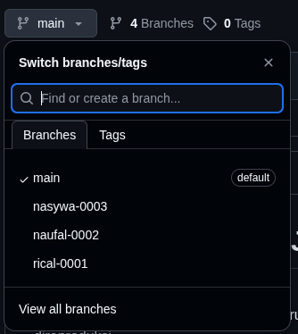

# Uji Kompetensi 1 - Jaringan Telekomunikasi

**Petunjuk Umum:**  
Kerjakan kedua soal berikut secara berurutan. Pastikan semua langkah terdokumentasi dengan baik dan dapat direproduksi.

---

## Soal 1: Konfigurasi Server VoIP (Asterisk on Ubuntu)

### Tujuan
Membangun server VoIP sederhana menggunakan **Asterisk** pada sistem operasi **Ubuntu**, serta menguji koneksi antar extension menggunakan klien **Zoiper**.

### Langkah yang Harus Dilakukan
1. Konfigurasi Asterisk pada Ubuntu.
2. Tambahkan **user/extension** dengan ketentuan berikut:
   - **Username:** Nama lengkap atau nama depan
   - **Extension (Nomor internal):** empat digit terakhir NIM (contoh: jika NIM = 607052300001, maka extension = `0001`)

### Kriteria Pengujian
- Masing-masing extension berhasil melakukan registrasi ke server Asterisk.
- Panggilan antar extension berhasil dilakukan menggunakan aplikasi **Zoiper**.

### Tentang Asterisk
Asterisk adalah Private Branch Exchange (PBX) open-source yang memungkinkan pengelolaan panggilan VoIP. Penambahan extension dilakukan melalui file konfigurasi seperti `sip.conf` (chan_sip) atau `pjsip.conf` (chan_pjsip). Zoiper berperan sebagai User Agent untuk meregistrasi dan melakukan panggilan.

---

## Soal 2: Dokumentasi & Manajemen Kode dengan Git

### Tujuan
Mendokumentasikan seluruh proses pengerjaan Soal 1 dan mengelola versi dokumentasi tersebut menggunakan Git.

### Langkah yang Harus Dilakukan
1. Buat dokumentasi teknis untuk **Soal 1**, mencakup:
   - Langkah konfigurasi Asterisk
   - Konfigurasi extension (nama & NIM)
   - Proses pengujian dengan Zoiper (sertakan tangkapan layar)
   - Kesimpulan atau kendala yang dihadapi

2. Lakukan [fork](https://github.com/ricalnet/ujikom-1-jartel/fork) terhadap repositori ini ke akun GitHub masing-masing.
3. Simpan dokumentasi tersebut dalam file **`dokumentasi-nama-anda.md`** di root folder proyek.

4. **Push** ke repositori dengan aturan branching berikut:
   - Setiap praktikan membuat **branch baru** dari branch utama.
   - Format nama branch: `nama-nim`
     - Contoh: `naufal-0001`, `rical-0002`, `nasywa-0003`
      

### Tentang Git
Git memungkinkan pelacakan perubahan dokumen secara kolaboratif. Dengan membuat branch terpisah (`nama-nim`), setiap peserta bekerja secara independen tanpa mengganggu pekerjaan orang lain. `README.md` adalah standar dokumentasi proyek di platform seperti GitHub/GitLab. 

---

**Selamat mengerjakan!**